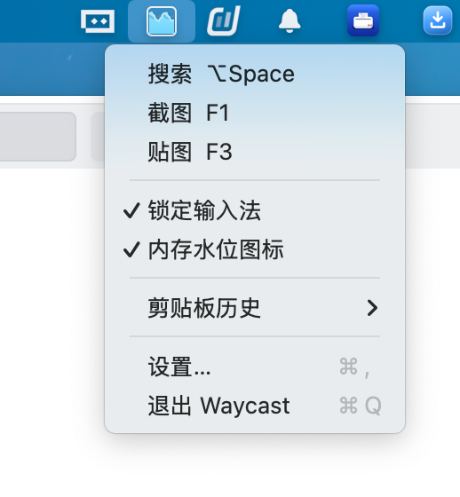
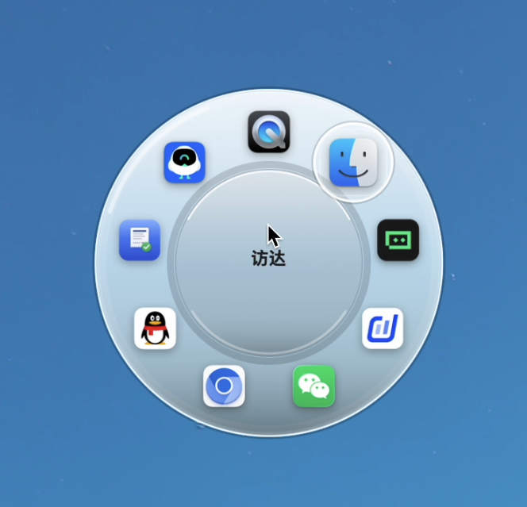
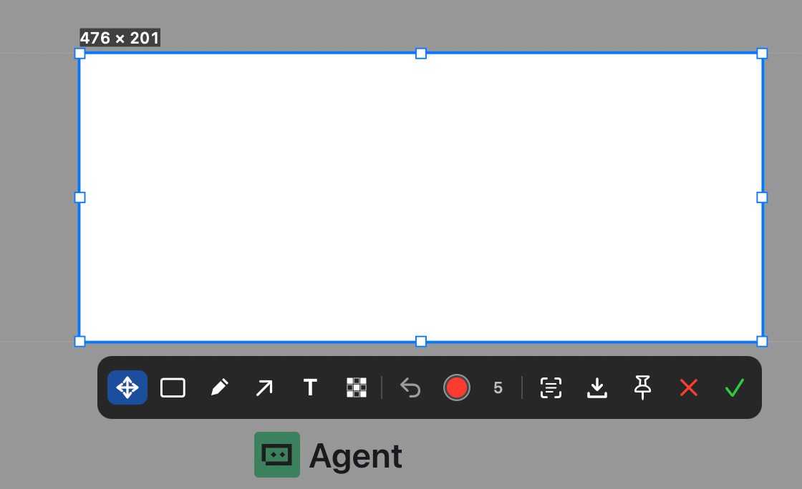
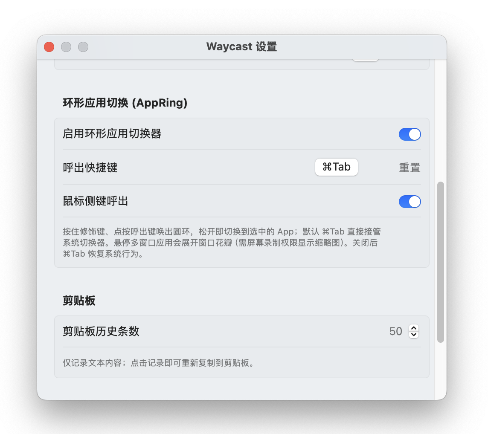

# Waycast

一款 macOS 菜单栏效率工具，把**环形应用切换、截图标注、贴图、Spotlight 式搜索、剪贴板历史、输入法锁定、内存水位监控**整合进一个常驻状态栏的应用。无 Dock 图标，随叫随到。

## 功能一览

| 功能 | 呼出方式 | 说明 |
|---|---|---|
| 环形应用切换 (AppRing) | `⌘Tab` / 鼠标侧键 | 接管系统切换器，光标处弹出毛玻璃圆盘 |
| 截图 | `F1`（可自定义） | 全屏框选 + 标注工具栏 + OCR |
| 贴图 | `F3`（可自定义） | 框选区域钉在屏幕最上层 |
| 搜索面板 | 状态栏菜单 / 自定义快捷键 | Spotlight 式启动器，支持中英文应用名 |
| 剪贴板历史 | 状态栏菜单 | 文本历史，跨重启持久化 |
| 锁定输入法 | 状态栏菜单 | 固定当前输入法，防止误切 |
| 内存水位图标 | 状态栏菜单 | 状态栏实时显示内存占用 |

所有功能都汇聚到右上角状态栏图标的一个菜单里：

---

## 1. 环形应用切换 (AppRing)

用 `⌘Tab` 直接接管系统切换器，在**鼠标指针所在位置**弹出一个毛玻璃圆盘，按最近使用（MRU）顺序排列应用图标。按住修饰键、点按呼出键唤出圆环，松开即切换到选中的 App——肌肉记忆与系统切换器完全一致。

悬停在一个拥有多个窗口的应用上，会展开「窗口花瓣」，显示每个窗口的实时缩略图与标题，点选即可聚焦到具体那个窗口（窗口级切换）。

**设置项**（见下方设置界面）：
- 启用/禁用总开关（关闭后 `⌘Tab` 恢复系统原生行为）
- 呼出快捷键自定义（可捕获 `⌘Tab` 本身）
- 鼠标侧键（按键 4 / 5）呼出开关

## 2. 截图

`F1` 进入全屏截图遮罩，拖拽框选区域。选区确定后浮现标注工具栏，支持：

- **移动 / 矩形 / 画笔 / 箭头 / 文字 / 马赛克** 六种工具
- **OCR 文字识别**（中英文，结果自动复制并可编辑）
- **保存**（默认导出到桌面）/ **复制到剪贴板** / **贴图**
- 撤销、颜色选择、线宽/字号调节（选中工具后滚动滚轮）
- 圆角矩形选区、任意工具模式下拖拽控制点缩放选区
- 右键任意处或 `Esc` 取消，双击或 `⌘C` 快速完成

## 3. 贴图 (Pin)

`F3` 框选一块屏幕区域，直接把它作为浮动窗口钉在屏幕最上层，适合对照参考、临时置顶信息。

## 4. Spotlight 式搜索面板

- 锚定在屏幕顶部、固定搜索框、结果向下展开，与原生 Spotlight 交互一致
- **中英文双向匹配**：既能搜英文文件名，也能搜 App 的中文本地化显示名（如「磁盘工具」「活动监视器」「日历」）
- 图片 / 视频结果显示缩略图（QuickLook 生成 + 缓存）
- 结果列表中的文件可**直接拖拽**到访达、邮件、聊天窗口等任意位置
- 点击面板外部一律关闭；支持中文输入法合成期间的回车提交
- 搜索面板位置按显示器记忆

## 5. 剪贴板历史

- 自动记录复制过的文本内容，条数可配置（默认 50）
- 点击任意历史条目即可重新复制到剪贴板
- **跨应用重启持久化**（原子写入本地文件，不会丢失）

## 6. 锁定输入法

一键锁定当前输入法，避免在全屏应用或游戏中误触切换。

## 7. 内存水位图标

勾选后状态栏图标变为一个动态「水位杯」，根据内存占用显示**蓝 / 黄 / 红**三色水位，波浪以 1fps 流动，直观反映系统内存压力。再次点击切回默认闪电图标。开销极低（CPU 约 0.2–0.3%），关闭时零占用。

## 8. 开机自启

设置界面提供「开机自启动」开关（基于 macOS 原生 `SMAppService`）。

---

## 设置界面

所有可配置项集中在一个设置窗口：

包含：开机自启、全局快捷键（搜索 / 截图 / 贴图）、环形应用切换 (AppRing)、剪贴板历史条数、使用提示。

## 权限说明

Waycast 需要以下系统权限，首次启动会自动引导授权：

- **屏幕录制**：截图、贴图、搜索缩略图、AppRing 窗口花瓣实时缩略图
- **辅助功能 (Accessibility)**：AppRing 环形切换器的事件拦截（`⌘Tab` 接管）

> 注意：从独立 AppRing 整合而来后，辅助功能权限的主体变为 **Waycast**，请在「系统设置 › 隐私与安全性 › 辅助功能」中勾选 Waycast。

## 下载与安装

前往 [Releases](https://github.com/lrylnx/Waycast/releases) 页面下载 `Waycast.zip`，解压后将 `Waycast.app` 拖入「应用程序」文件夹，首次运行按提示授予权限即可。

> **首次打开被系统拦截？** Waycast 使用 ad-hoc 签名、未经 Apple 公证，从浏览器下载后 macOS 会加上隔离属性，双击可能提示「无法打开，因为 Apple 无法验证」。任选其一解决：
>
> - 在「应用程序」里**右键点按** Waycast → **打开**，在弹窗中再点一次「打开」；
> - 或执行一次：`xattr -dr com.apple.quarantine /Applications/Waycast.app`
>
> 之后正常双击即可。

## 系统要求

macOS 14.0 或更高版本。
